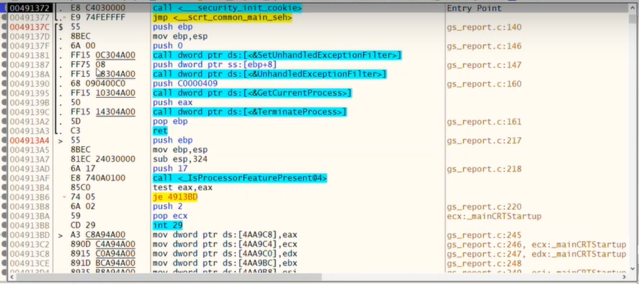

# 01 CursoReversing desde cero (X64DBG PRIMEROS PASOS)
## ¿Qué es un debugger?
Un **debugger** (depurador) es una herramienta que permite analizar, modificar y controlar la ejecución de programas en tiempo real. Es fundamental para el análisis de **binarios, malware, exploits y protección de software.

### 🔍 **¿Qué hace un debugger?**
1. **Ejecutar programas paso a paso** 🐢➡️🔎  
   Permite analizar la ejecución del código instrucción por instrucción.

2. **Colocar breakpoints (puntos de interrupción)** 🎯  
   Se pueden establecer pausas en puntos clave del programa para analizar su estado.

3. **Modificar registros y memoria** 📝🔄  
   Es posible cambiar valores de registros, variables y direcciones de memoria en tiempo real.

4. **Inspeccionar y alterar la pila (stack)** 📚🔍  
   Ayuda a entender el flujo del programa y manipular la ejecución.

5. **Desensamblar el código** 🛠️🔡  
   Convierte código máquina en lenguaje ensamblador para su análisis.

6. **Detectar técnicas anti-debugging** 🕵️‍♂️  
   Muchos programas usan protecciones para evitar la ingeniería inversa, y los debuggers permiten sortearlas.

### 🛠 **Ejemplo de debugger**
🔹 **x64dbg**  
   Es un **debugger de código abierto** para Windows, usado en el análisis de programas de 32 y 64 bits. Es una alternativa moderna a OllyDbg y permite:
   - Depurar archivos PE (Portable Executable).
   - Soporte para plugins y scripting.
   - Visualización de instrucciones en ensamblador.
   - Análisis de llamadas a APIs del sistema.

🔹 **Otros debuggers populares**  
   - **OllyDbg**: Similar a x64dbg, pero más antiguo (solo 32 bits).  
   - **WinDbg**: Debugger de Microsoft, usado para kernel y aplicaciones.  
   - **GDB**: Usado en Linux para debugging de programas en C/C++.  
   - **IDA Pro**: Incluye un debugger y desensamblador avanzado, usado en malware analysis.



### 📌 Entry Point

El **Entry Point** (EP) es la dirección de memoria donde comienza la ejecución principal del programa cuando se carga en memoria. Es el primer punto donde se ejecutan instrucciones después de que el sistema operativo ha realizado la carga del ejecutable.

La dirección **00491372** es donde inicia la ejecución del binario en este caso, con la instrucción:

```
call <_security_init_cookie>
```

### Primera columna de la imagen 

**Dirección de memoria**
Una **dirección de memoria** es un identificador (en hexadecimal) único que señala la ubicación de un dato o instrucción dentro de la memoria RAM de un sistema. Es como el número de una casa en una calle, pero en lugar de casas, tenemos datos e instrucciones almacenadas en la memoria.

### Segunda columna de la imagen

**Opcode**
Un **opcode** (operation code, hexadecimal) es la representación en código máquina de una instrucción de ensamblador. Cada instrucción de un procesador tiene un opcode específico.
Por ejemplo, en la imagen:
-  `E8 C4030000` → Es un **opcode** que representa la instrucción `call <_security_init_cookie>`.

### Tercera columna de la imagen
Representación en ensamblador de los opcodes (desensamblado), donde se pueden ver instrucciones como `call`, `jmp`, `push`, `mov`, etc.

---

### La forma en que se leen o almacenan los bits en la memoria tiene nombres específicos:

1. **Big-endian**: Se lee de izquierda a derecha, es decir, el bit más significativo (MSB) está en la posición más baja de memoria y el bit menos significativo (LSB) en la posición más alta.
    
2. **Little-endian**: Se lee de derecha a izquierda, es decir, el LSB está en la posición más baja de memoria y el MSB en la posición más alta.
    

Estos términos no solo se aplican a la lectura de bits dentro de un número binario, sino también al almacenamiento de bytes en la memoria en sistemas de cómputo.

---

### Tamaños de almacenamiento en memoria

La unidad básica de almacenamiento para todos los datos en una computadora x86 es un **byte**, que contiene 8 bits. Otros tamaños de almacenamiento son:

- **Word (palabra):** 2 bytes
- **Doubleword (doble palabra):** 4 bytes
- **Quadword (cuádruple palabra):** 8 bytes

